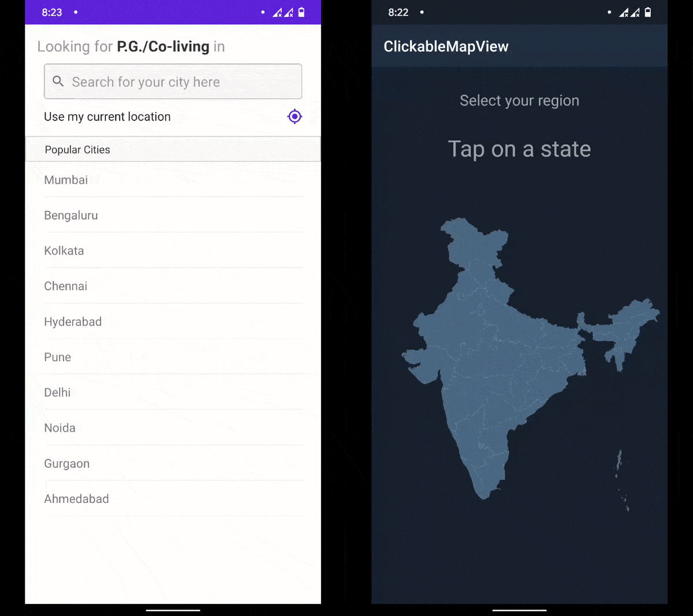

 # Clickable Map View - Android

Hey 👋, this project a part of [Foodmux](http://github.com/goforbg/foodmux), an upcoming food community app. 
I decided to make this open source since I didn't find anything like this when I wanted to.
This project is a cool way to make your users select their state from a map on Android.
Feel free to add other maps to the repo, with a pull request. This project wouldn't have been possible without RichPath Library. 
  
# Demo

 

### Special Thanks to:

* [RichPath Library][10]

[10]:https://github.com/tarek360/RichPath

Do you want to contribute?
--------------------------

Feel free to report or add any useful feature, I will be glad to improve it with your help.
The main issues right now are to:
 * Test it with old Samsung devices, 
 * Add zoom feature,
 * Need more maps.

Developed By
------------

* Bharadwaj Giridhar
* Ahmed Tarek - Rich Path Library
